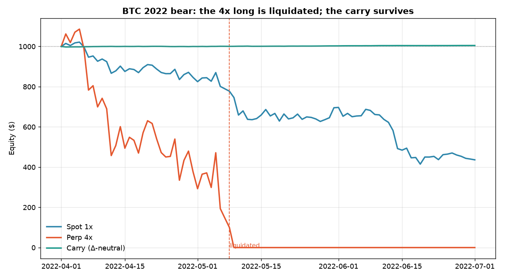
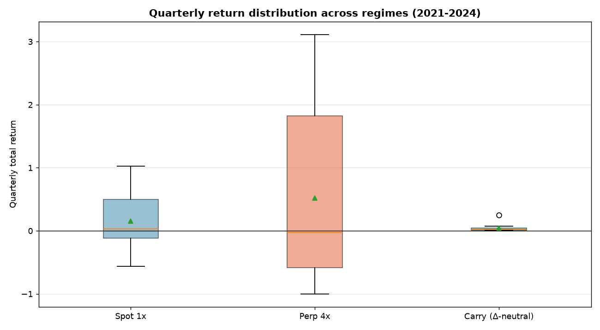

# Perpetual vs Spot: is BTC funding a harvestable carry?

[](https://github.com/dan-allouche-qf/perpetual-vs-spot-analysis/actions/workflows/ci.yml)
[](https://www.python.org/)
[](LICENSE)
[](https://nbviewer.org/github/dan-allouche-qf/perpetual-vs-spot-analysis/tree/main/notebooks/)

📄 **Full write-up: [`report/report.pdf`](report/report.pdf)** — the methodology and results as a short paper.

**Thesis.** A long BTC perpetual pays *funding*. Treated as a cost on a leveraged
long it just erodes returns — but harvested **delta-neutrally** (long spot, short
perp) it is a double-digit-APR carry with near-zero price risk. This repo tests
that on BTC/ETH/SOL across the 2021 bull, the 2022 bear and the 2023–24 recovery,
and shows that *the edge is the funding carry, not the leverage.*



> In the 2022 sell-off a 4× perp long is **liquidated**; a delta-neutral carry on
> the same data is flat-to-up the entire time.

---

## Headline results

**Walk-forward across all 16 non-overlapping quarters, 2021–2024 (BTC, $1,000, 4× perp):**

| Strategy | Median qtr return | Worst qtr | Median Sharpe | Worst drawdown | Liquidations |
|----------|------------------:|----------:|--------------:|---------------:|-------------:|
| **Carry (Δ-neutral)** | **+2.2%** | +0.4% | **9.1** | −0.5% | **0 / 16** |
| Perp 4× (net funding) | −3.1% | **−100%** | 1.1 | **−100%** | **3 / 16** |
| Spot 1× | +3.0% | −56% | 0.5 | −59% | 0 / 16 |

The 4× long’s **median** quarterly return is negative and it blows up roughly one
quarter in five — the "leverage wins" story is survivorship bias from a single
bull window. The carry is the only book with an attractive risk-adjusted profile
in *every* regime, and it generalizes to ETH and SOL (notebook 3).



**A single-window case study (2024-01-01 → 2024-03-20, 1,000 USDT, 4× perp):**

| Strategy | Return | Sharpe | Max drawdown | Funding |
|----------|-------:|-------:|-------------:|--------:|
| Spot 1× | +60.2% | 3.78 | −15.8% | — |
| Perp 4× | +215.2% | 3.85 | −50.5% | −$261 |
| Carry (Δ-neutral) | +6.2% | 15.2 | −0.3% | +$65 |

Even here the lesson is **no free risk-adjusted lunch**: leverage scales return
*and* volatility, so the 4× Sharpe ≈ the 1× Sharpe while drawdown scales ~3×.
Funding would have to reach **~170% APR** to erase the leverage edge in this
window — but unconditionally (table above) leverage still loses.

---

## Methodology highlights

The choices that make the analysis defensible rather than a curve-fit:

| Topic | Approach |
|-------|----------|
| Market integration | Correlation of **returns** (0.99996) — not of price levels, which is spurious for trending series — plus a stationary mean-reverting **basis** (mean −1 bp, half-life 4.8 d, ADF p≈3e-5) and an Engle–Granger **cointegration** test |
| Return distribution | Tested, not assumed: excess kurtosis **3.4**, Jarque–Bera p≈0 → fat-tailed, **not normal** (QQ-plot in nb 1) |
| Volatility | **Annualized** (≈62%), with a Levene test for the spot-vs-perp variance gap |
| Funding | Quoted as an **APR on notional** (~14% full-history) and bps/8h — leverage-invariant |
| Leverage | A falsifiable **break-even funding** rate and a walk-forward **distribution** with bootstrap CIs, not a single window |
| Path risk | Daily **mark-to-market** equity with a 4× **liquidation guard**, so mid-window ruin is visible |

---

## The carry strategy

Hold **+size BTC spot** and **−size BTC perp** (notional-matched), so net price
exposure is the small mean-reverting basis only. The short perp leg **receives**
funding when the rate is positive:

```
daily P&L = size·(Δspot − Δperp)  +  Σ fundingRateᵢ · markPriceᵢ · size  −  taker fees
            └── basis change ≈ 0 ──┘   └────── funding income ──────┘
```

Funding accrues strictly inside the holding window `(open_ts, close_ts]`, derived
from a single source-of-truth window shared with the price legs so the two never
drift apart.

---

## Reproduce

```bash
make setup      # install the package + dev/app extras into a venv
make test       # 29 unit tests on the funding/P&L/metrics math (offline)
make lint       # ruff + mypy
make figures    # regenerate docs/figures/ from the committed snapshot
make notebooks  # execute all 3 notebooks offline from data/raw/
make report     # recompute numbers and compile report/report.pdf
make app        # launch the interactive Dash explorer
make data       # (optional) rebuild the Parquet snapshot from data.binance.vision
```

Everything runs **offline** from the committed `data/raw/*.parquet` snapshot, so it
reproduces identically even from US IPs (where live `api.binance.com` returns 451).

## Repo structure

```
src/perp_spot/     data · funding · metrics · stats · strategy · backtest · plots
notebooks/         01 market structure · 02 funding carry (flagship) · 03 leverage risk
scripts/           fetch_data · make_figures · report_numbers · app (Dash)
tests/             pytest suite (funding/strategy/metrics/data)
data/raw/          committed Parquet snapshot (BTC/ETH/SOL, 2021–2024)
docs/              rendered notebook HTML + hero figures
report/            LaTeX source + compiled report.pdf
```

Rendered notebooks (with charts): [01](docs/01_market_structure.html) ·
[02](docs/02_funding_carry.html) · [03](docs/03_leverage_risk.html) — or browse
on [nbviewer](https://nbviewer.org/github/dan-allouche-qf/perpetual-vs-spot-analysis/tree/main/notebooks/).

## Method notes & limitations

- **Funding** uses the realized per-settlement rate and the 8h mark price for the
  notional; APR figures assume the 8h schedule (BTC throughout; some ETH/SOL
  periods used 4h and are an approximation).
- **Liquidation guard** is a simplified flat maintenance-margin check, not a
  tick-level liquidation engine; it caps the leveraged loss at the posted margin.
- **Frictions**: round-trip taker fees on notional are charged; slippage, partial
  fills, borrow constraints on the spot leg and funding-rate impact are not
  modelled. The carry assumes the short-perp leg is always fundable.
- Results are historical and **regime-dependent** (funding compresses and can
  invert in bear markets); this is research, not investment advice.

## License

[MIT](LICENSE) · Author: Dan Allouche · Data © Binance (data.binance.vision)
